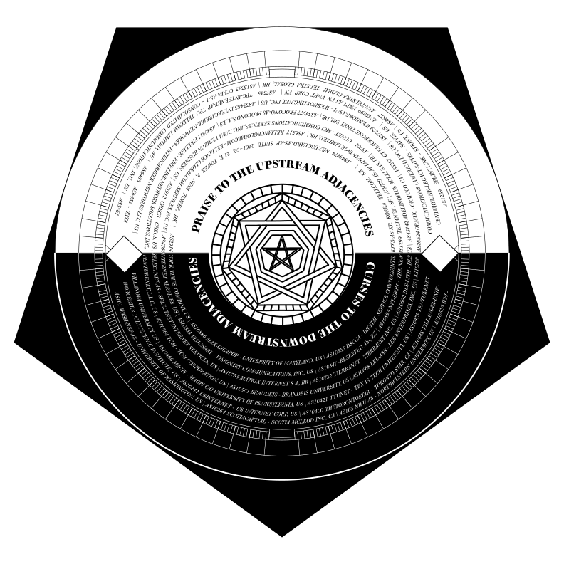

## The Coven
**The Coven** refers to the many orders, sects, and guilds that work to enable Rough Telepathy. These maintain instruments of divination, keep records, interface between the Warring Kingdoms and the Merchants, store the Unique Runes and Talismans, and write and test spells that govern The Realm. 

## Guilds

**Guilds** refer to affinity groups generally engaged in the production of the occult goods and services required for support of The Realm and the production of Rough Telepathy. The Guilds discussed in the the first RORT bundle are primarily the **Alchemists**, those who transform fire, sand, coal, water, and other earth elements to create the material foundation required for Rough Telepathy (a worthy subject for future scholarship), and **Regional Telepathy Registries**, who maintain the Unique Runes and Talismans, and who have direct ties to the Orders, Sects, and Fiefdoms. 

## Orders and Sects

**Orders and Sects** are formed around shared concerns. They rely on the material foundation produced by the Alchemists, which provides the necessary environment in which to accomplish their spellcasting and record keeping. They are often engaged in the care and maintenance of specific spells. Some members spend their life tinkering deeply with a single spell, while others are affiliated with of multiple Orders and Sects. 

## Ritual Festivals

**The Ritual Festivals** are the regular ceremonies that bind members of various orders, sects, and guilds across the Coven. Each has its preferred temples of practice, worship, and creation, but all engage in ritual festivals. Ostensibly these festivals serve as fora for discussion of the standardizing and testing of spells, the ratification occult protocol, and for building consensus on key technical and political concerns of The Realm. However, the festivals are often equally focused on carnivalesque gallivanting, bawdy jokes, and copious alcohol drinking. The osmotic layer of sociality is as powerful a factor in determining the future of The Realm as are the spells themselves. Examples of Ritual Festivals include IETF meetings, NANOG meetings, RIPE meetings, ICANN meetings, IGF and ITU conferences, Shmoocon and various Cons, and a seemingly ceaseless string regional gatherings and workshops. 

## Merchants

**Merchants** are a mercantile class who harnessed the power of Rough Telepathy as a global force for commerce and trade in the mid 1990s, subverting and surpassing the scope and vision laid out by the early members of the Coven. The Merchants are now more powerful than The Coven, and have absorbed many of its members. However, the foundational spells and ritual magic that enables Rough Telepathy is still in use, maintained by Coven members with material support and direction from the Merchants and occasional Warring Kingdoms. The Merchants’ ascent happened suddenly -- in the late 1990’s those participating in Rough Telepathy grew 10,000% in just a few years, driven by the new uses of Rough Telepathy pioneered by the Merchants. This change took many in the Coven by surprise, some delighted, some skeptical. Whatever their reaction, the impact of this change on the power and relevance of the Coven has not been acknowledged by many of its key Orders and early members, resulting in hidebound rituals decreasingly tied to the day-to-day practice of Rough Telepathy. The Merchants have constructed vast private temples of worship, concentrated near San Jose California, most of which exude the drab chipperness of a rich man eager to be congratulated for driving a moderately-priced car. 

## The Fiefdoms 

 

 

	
	<caption>A Traditional <a href="../sigils/peering/">Peering Sigil of a Shadow Fiefdom</a></caption>

**Fiefdoms** bring Rough Telepathy to the masses, often acting as an interface between the daily participant in Rough Telepathy -- regular individuals engaging in commerce or long-distance jokes -- and various segments of The Coven. Each Fiefdom is individually responsible for the maintenance of alchemical infrastructure and the incantation of the spells necessary for Rough Telepathy in its region. To enable Rough Telepathy globally for all participants, Fiefdoms commit to connect with one another across the borders of Warring Kingdoms, a practice referred to as a peer relationship. Fiefdoms can be ruled variously by Merchants, Warring Kingdoms, or Coven members -- the only requirement to becoming a Fiefdom is that one incant the spells correctly (the test of which is the possibility of Rough Telepathy across Fiefdom boundaries), obtain alchemical infrastructure, and acquire unique runes from the local Regional Telepathy Registry. There are two basic categories of Fiefdom, and some Fiefdoms fit in both categories: 

**Visible Fiefdoms** provide the masses a means to participate in Rough Telepathy, carrying telepathic signals to scrying mirrors owned by individual participants. They charge a fee for this service, which includes granting use of a Unique Rune, and maintaining the spells and alchemical infrastructure necessary to facilitate telepathic connection between a person and any other participant. Examples of Visible Fiefdoms include Comcast, AT&T, Orange, Verizon, Vodafone, T Mobile, and many others. 

**Shadow Fiefdoms** sit closer to the Coven, and exist to bridge the gaps between Visible Fiefdoms, ensuring all touches all in vast telepathic connection. Examples of Shadow Fiefdoms include Cogent, Level3, XO Communications, Telia Sonora, and many others. 

## The Warring Kingdoms

**The Warring Kingdoms** are sovereignties, each more or less ambivalent to the power and annoyance of Rough Telepathy. The Warring Kingdom of the United States is most closely tied with the ascent of Rough Telepathy, which grew out of a speculative project it founded and supported. Warring Kingdoms play multiple roles in The Realm, from support and material aid of various Coven functions, to managing Fiefdoms, to vocally resisting various uses of Rough Telepathy. The Warring Kingdoms view Rough Telepathy both as a threat and an asset, a determination based haphazardly their own mutable self-interests. In recent years the Warring Kingdoms of the Five Eyes have received global attention for their use of Invasive Telepathy, a means by which Rough Telepathy is harnessed and subverted in ways that allow collection of the most tender and personal thoughts, ideas, and lived experiences of Rough Telepathy participants. This revelation led to general sadness, restraint, and distrust among Coven members and subjects at large. Due to the weakness of many spells, the complex involvement of Warring Kingdoms in Coven activities, and the ambivalence of the Merchants, a realistic set of spells that would prevent Invasive Telepathy has yet to be proposed. 